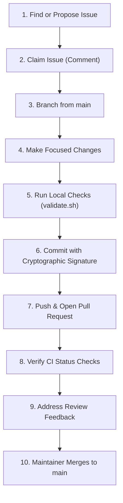

# Contributing to Personal Data OS

Thank you for your interest in contributing to **Personal Data OS**! We welcome contributions that align with our core architectural principles, vertical-slice methodology, and strict privacy standards.

This guide details everything you need to know to get started, set up your development environment, follow our branch and commit conventions, configure required commit signing, and submit pull requests.

---

## 1. Before You Start

Personal Data OS is an open-source, self-hosted personal telemetry system designed for complete personal data ownership. Before writing code or opening a pull request, please review our foundational documentation:

- [PROJECT_CONTEXT.md](PROJECT_CONTEXT.md) — Product vision, roadmap milestones, and key architectural rationales.
- [docs/architecture.md](docs/architecture.md) — System layers, component interactions, and vertical-slice design.
- [docs/development.md](docs/development.md) — Detailed local environment setup and prerequisites.
- [docs/database.md](docs/database.md) — PostgreSQL standards, migrations, and `sqlc` query patterns.
- [docs/api.md](docs/api.md) — REST API conventions, standard error formats, and OpenAPI guidelines.
- [SECURITY.md](SECURITY.md) — Security policies, vulnerability disclosure procedures, and operator responsibilities.

### Two Non-Negotiable Directives

1. **Strict Data Privacy**: Never commit real personal data (e.g. sleep hours, health metrics, reading lists, habits) or credentials (API tokens, passwords, `.env` files). All test fixtures, mock data, and screenshots must use synthetic data.
2. **Respect the Architecture**: Do not introduce architectural complexity (microservices, Kafka, Redis, or heavy ORMs) outside of approved roadmap specifications.

---

## 2. Core Engineering Principles

We adhere to the following principles across all subsystems:

1. **Modular Monolith**: The platform is built as a single, maintainable modular monolith (Go Chi backend, React Vite frontend, PostgreSQL 16 database). We avoid the operational complexity, distributed failures, and network overhead of microservices, message queues (Kafka, RabbitMQ), and distributed caches (Redis).
2. **Explicit SQL with `sqlc`**: All database interactions use version-controlled SQL migrations (`golang-migrate` format in `api/db/migrations/`) and compile-time type-safe Go code generated by `sqlc` (`api/db/queries/`). We do not use GORM, Ent, or other heavy ORMs.
3. **Vertical Slice Development**: Features are architected as full vertical product slices spanning database migrations, explicit queries, domain services, HTTP handlers, OpenAPI documentation, frontend API clients, and React UI components.
4. **Focused Implementation Issues**: Large features are broken down into PR-sized implementation issues (database, backend, frontend, documentation, or testing). Each PR should address a single implementation issue and remain traceable to its parent feature.
5. **No Scope Creep**: Keep changes strictly focused on the acceptance criteria of the assigned issue. Do not introduce unrelated refactoring, speculative abstractions, or unrequested features.

---

## 3. End-to-End Contribution Workflow

To contribute smoothly, follow this end-to-end workflow:



1. **Find or Propose an Issue**: Check [GitHub Issues](https://github.com/rodrigolinhas/personal-data-os/issues) for open tasks. For new trackers or integrations, submit a proposal using the repository issue templates (`tracker_proposal` or `integration_proposal`).
2. **Claim the Work**: Comment on the implementation issue before starting work to coordinate with others and avoid duplicate efforts.
3. **Branch from Latest `main`**: Ensure your local `main` is up to date (`git pull origin main`) and create a focused branch following our [Branch Naming Conventions](#5-branch-naming-conventions).
4. **Make Focused Changes**: Implement the code, migrations, or documentation necessary to satisfy the issue acceptance criteria.
5. **Run Local Checks**: Verify formatting, linting, tests, and builds locally using `./scripts/validate.sh` before pushing.
6. **Create Cryptographically Signed Commits**: Craft Conventional Commit messages and ensure they are cryptographically signed using SSH, GPG, or S/MIME. (See [Commit Signing](#7-commit-signing).)
7. **Push and Open a Pull Request**: Push your branch to GitHub and open a pull request targeting `main` using the provided [Pull Request Template](.github/PULL_REQUEST_TEMPLATE.md).
8. **Verify CI Checks**: Ensure all automated GitHub Actions checks (Backend, Frontend, govulncheck, CodeQL) pass cleanly.
9. **Resolve Review Comments**: Address questions or suggestions from maintainers. Keep conversations respectful and resolve review threads once completed.
10. **Merge**: Once approved and all status checks pass, a maintainer will merge your PR to `main`.

---

## 4. Finding and Claiming Work

When exploring work in the repository, distinguish between:

- **Parent Feature Issues**: Define complete, user-facing capabilities and domain acceptance criteria (e.g. Milestone 2 Sleep Tracking).
- **Implementation Issues**: Define focused, PR-sized tasks (e.g. database schema migration, specific REST endpoints, React UI components, documentation refactor).

### Rules for Claiming Work

- Always prefer claiming an **implementation issue** rather than an entire parent feature.
- Comment on the issue stating your intention to work on it to coordinate with others.
- Ensure the implementation issue remains linked to its parent feature and milestone.
- If no implementation issue exists for a subtask you want to address, open an issue first or ask in the parent issue discussion before submitting a PR.

---

## 5. Branch Naming Conventions

All branches must originate from an up-to-date `main` branch. Use the following naming structure:

| Type | Branch Pattern | Example |
| :--- | :--- | :--- |
| **Feature** | `feat/<issue-number>-<short-description>` | `feat/1-sleep-tracking` |
| **Bug Fix** | `fix/<issue-number>-<short-description>` | `fix/4-connection-pool-timeout` |
| **Documentation** | `docs/<issue-number>-<short-description>` | `docs/26-contributing-guide` |
| **Refactoring** | `refactor/<issue-number>-<short-description>` | `refactor/18-http-error-helpers` |
| **Testing** | `test/<issue-number>-<short-description>` | `test/22-sleep-handler-integration` |
| **Maintenance** | `chore/<issue-number>-<short-description>` | `chore/21-validate-script` |

Keep `<short-description>` lowercase, hyphen-separated, and concise.

---

## 6. Commit Message Conventions

We follow the [Conventional Commits](https://www.conventionalcommits.org/) specification:

```text
<type>(<optional scope>): <description in imperative mood>
```

### Commit Types
- `feat`: A new user-facing feature or API endpoint
- `fix`: A bug fix
- `docs`: Documentation updates only
- `test`: Adding, updating, or fixing tests
- `refactor`: Code changes that neither fix a bug nor add a feature
- `chore`: Tooling, dependency, build script, or CI updates

### Examples
- `feat(sleep): add sleep_logs schema migration and sqlc queries`
- `feat(api): expose POST /api/v1/sleep handler`
- `fix(database): configure ping timeout on connection pool`
- `docs(contributing): document contributor workflow and commit signing`
- `test(web): add unit tests for sleep metrics card`
- `chore(scripts): update validate script for local testing`

---

## 7. Commit Signing

The `main` branch ruleset requires that **all commits must be cryptographically signed**. Commits without a verifiable cryptographic signature will be rejected during pull request checks and cannot be merged into `main`.

### Critical Distinction: Cryptographic Signing vs. Sign-Off (`-s`)

It is vital to understand the difference between Git sign-off and cryptographic commit signing:

| Mechanism | Command / Flag | Purpose | Satisfies Required Signed Commits? |
| :--- | :--- | :--- | :--- |
| **Sign-Off (DCO)** | `git commit -s` | Appends a `Signed-off-by: Name <email>` text trailer to the commit message. Used for Developer Certificate of Origin. | ❌ **No** (Plain text trailer; no cryptographic proof) |
| **SSH Commit Signing** | `git commit` (configured) or `-S` | Cryptographically signs the commit object using an SSH private key registered with GitHub. | ✅ **Yes** |
| **GPG Commit Signing** | `git commit` (configured) or `-S` | Cryptographically signs the commit object using a GPG private key registered with GitHub. | ✅ **Yes** |
| **S/MIME Commit Signing** | `git commit` (configured) or `-S` | Cryptographically signs the commit object using an X.509 certificate registered with GitHub. | ✅ **Yes** |

> [!IMPORTANT]
> Running `git commit -s` does **NOT** cryptographically sign a commit. It only adds a plain-text `Signed-off-by:` line. Personal Data OS does not require DCO sign-off trailers, but it **strictly requires cryptographic commit signing**.

---

### Setting Up SSH Commit Signing (Recommended)

GitHub supports commit signing using SSH keys, GPG keys, and S/MIME certificates. **SSH signing** is recommended because it is lightweight, fast, and does not require managing a separate GPG agent or daemon.

#### Step 1: Generate or Select an SSH Key
If you do not already have an SSH key dedicated to signing, generate an ED25519 key:

```bash
ssh-keygen -t ed25519 -C "you@example.com" -f ~/.ssh/id_ed25519_github_signing
```

> [!WARNING]
> **Never share or upload your private key** (`~/.ssh/id_ed25519_github_signing`). Only public keys ending in `.pub` (`~/.ssh/id_ed25519_github_signing.pub`) are uploaded to GitHub.

#### Step 2: Add the Public Key to GitHub as a Signing Key
1. Copy your public key:
   ```bash
   cat ~/.ssh/id_ed25519_github_signing.pub
   ```
2. In GitHub, go to **Settings** → **SSH and GPG keys**.
3. Click **New SSH key**.
4. In the **Key type** dropdown, select **Signing Key** (do *not* select "Authentication Key").
5. Paste your public key into the **Key** field and click **Add SSH key**.

#### Step 3: Configure Git to Sign with SSH
Run the following commands to configure Git globally (or omit `--global` to configure for this repository only):

```bash
# Tell Git to use SSH for signing
git config --global gpg.format ssh

# Specify your SSH signing key path
git config --global user.signingkey ~/.ssh/id_ed25519_github_signing

# Automatically sign every commit
git config --global commit.gpgsign true
```

*Note: Ensure your Git committer email (`git config user.email`) matches an email address verified on your GitHub account.*

#### Step 4: Verify Local Signatures (Optional)
To verify SSH signatures locally using `git log --show-signature`, Git needs an allowed signers file:

```bash
# Create the allowed signers directory and file
mkdir -p ~/.config/git
printf 'you@example.com %s\n' "$(cat ~/.ssh/id_ed25519_github_signing.pub)" > ~/.config/git/allowed_signers

# Tell Git where to find allowed signers for local verification
git config --global gpg.ssh.allowedSignersFile ~/.config/git/allowed_signers
```

Then test local verification:
```bash
git log -1 --show-signature
```
You should see:
```text
Good "git" signature for you@example.com with ED25519 key SHA256:...
```

*(Note: The allowed signers configuration is only needed for local CLI signature verification. GitHub verifies commits automatically against your account's registered Signing Keys.)*

---

### Everyday Commit Workflow After Setup

With `commit.gpgsign=true` configured, your commits are signed automatically:

```bash
git add .
git commit -m "feat(sleep): add sleep log duration validator"
```

You do **not** need to pass `-S` manually on every commit.

---

### Troubleshooting Commit Signing

- **Commit shows "Unverified" on GitHub**:
  - Ensure the public key was uploaded as a **Signing Key** (not an Authentication Key) under GitHub Settings → SSH and GPG keys.
  - Verify that `git config user.email` matches an email address added and verified in your GitHub account.
- **Commit shows `Signed-off-by:` but GitHub says Unsigned**:
  - You used `git commit -s` instead of cryptographic signing. Configure `commit.gpgsign=true` and see below for how to re-sign existing commits.
- **Git error: `gpg.format=ssh, but no user.signingkey configured`**:
  - Run `git config --global user.signingkey ~/.ssh/id_ed25519_github_signing` pointing to your private key file.

---

### Rewriting Unsigned Commits on Your Feature Branch

If you created commits on your feature branch before configuring signing, you can re-sign them before opening or updating your pull request:

```bash
# Re-sign the last N commits on your feature branch
git rebase --exec 'git commit --amend --no-edit -S' HEAD~N

# Verify signatures locally
git log --show-signature -n N

# Safely push the updated branch to your fork / remote
git push --force-with-lease
```

> [!CAUTION]
> - **Only rewrite commits on your own feature branch.** Never rewrite history on `main` or shared collaboration branches.
> - Always use `git push --force-with-lease` rather than `git push --force` to prevent accidentally overwriting upstream changes.

---

## 8. Pull Request Expectations & Branch Protections

### Pull Request Checklist

When opening a Pull Request:
- **Target `main`**: All feature and bug fix branches must target `main`.
- **Link an Issue**: Include `Closes #<issue-number>` or `Fixes #<issue-number>` in the PR description.
- **Use the PR Template**: Follow [.github/PULL_REQUEST_TEMPLATE.md](.github/PULL_REQUEST_TEMPLATE.md) completely, describing the changes, testing methodology, and relevant checklist items.
- **Keep it Focused**: Avoid mixing unrelated changes, formatting passes across untouched files, or speculative code.
- **Update Documentation**: Update `docs/openapi/openapi.yaml` for API changes, migrations for schema changes, and relevant markdown files in `docs/`.
- **Synthetic Data Only**: Verify that no real health data, personal credentials, or `.env` files are contained in code, tests, or PR descriptions.

### Main Branch Protections

The `main` branch is protected by repository rulesets to ensure stability:
- Direct pushes to `main` are disabled. All changes must arrive via pull requests.
- All commits must be **cryptographically signed**.
- Required Continuous Integration (CI) status checks must pass before merging.
- All pull request review conversations must be resolved.
- Code owner reviews are required for designated paths (see [.github/CODEOWNERS](.github/CODEOWNERS)).

---

## 9. Local Development & Quality Checks

### Running PostgreSQL
Local development requires PostgreSQL 16, which is managed via Docker Compose:

```bash
docker compose up -d
docker compose ps
```

### Full Local Validation Script
We provide a local validation script that mirrors the checks executed in GitHub Actions:

```bash
# Run full suite (Backend + Frontend)
./scripts/validate.sh

# Run only Backend checks
./scripts/validate.sh --backend-only

# Run only Frontend checks
./scripts/validate.sh --frontend-only
```

### Subsystem Verification Commands

#### Backend (`api/`)
```bash
cd api

# 1. Verify code formatting
gofmt -l .
# To automatically format: gofmt -w .

# 2. Run static analysis
go vet ./...

# 3. Run unit and integration tests with the Go race detector
go test -v -race ./...

# 4. Check for known Go package vulnerabilities
govulncheck ./...

# 5. Verify compilation
go build -v ./cmd/api
```

#### Frontend (`web/`)
```bash
cd web

# Audit dependencies (high/critical findings fail validation)
npm run audit

# 1. Run TypeScript typecheck (strict noEmit)
npm run typecheck

# 2. Run ESLint
npm run lint

# 3. Check code formatting with Prettier
npm run format:check
# To automatically format: npm run format

# 4. Run Vitest unit tests
npm test -- --run

# 5. Build production bundle
npm run build
```

#### Database Migrations & Query Generation
When modifying database models:
- Migrations are stored in `api/db/migrations/` as paired `NNNNNN_name.up.sql` and `NNNNNN_name.down.sql` files.
- Explicit queries are defined in `api/db/queries/<domain>.sql`.
- Regenerate type-safe Go query code with:
  ```bash
  cd api
  sqlc generate
  ```

### Automated CI & Security Scanning

In addition to the standard verification commands above, the repository runs:
- **CodeQL**: Automated semantic code analysis scanning Go, JavaScript/TypeScript, and GitHub Actions workflows for vulnerabilities and security anti-patterns.
- **govulncheck**: Continuous vulnerability scanning of Go modules and dependencies in CI.
- **npm audit**: Frontend dependency auditing in CI and local validation. See [the remediation workflow](docs/development.md#frontend-dependency-security) for manual, reviewed dependency fixes.
- **Secret Scanning & Dependabot**: Automated detection of credentials and outdated dependencies.

---

## 10. Definition of Done

A pull request is ready for review and merge when all applicable criteria are satisfied:

### All PRs
- [ ] Addresses one focused implementation issue with clear scope.
- [ ] Implementation satisfies the issue acceptance criteria.
- [ ] All commits are cryptographically signed.
- [ ] Relevant tests are added or updated and passing.
- [ ] Existing tests continue to pass without regressions.
- [ ] Formatting, linting, and static analysis pass cleanly.
- [ ] Documentation is updated where applicable.
- [ ] No unrelated refactoring, dependencies, or scope creep included.
- [ ] No real personal data, credentials, API tokens, or `.env` files committed.

### Database PRs
When the issue changes persistence or schema:
- [ ] Reversible migrations (`.up.sql` and `.down.sql`) added under `api/db/migrations/`.
- [ ] Explicit queries added or updated under `api/db/queries/`.
- [ ] Generated `sqlc` code updated via `sqlc generate` in `api/db/sqlc/`.
- [ ] Database constraints enforce domain invariants (e.g. check constraints, foreign keys).
- [ ] Database/query tests added where appropriate.

### Backend / API PRs
When the issue modifies backend logic or HTTP endpoints:
- [ ] Domain logic and validation implemented in `api/internal/<domain>/`.
- [ ] HTTP handlers mounted in `api/internal/http/router.go`.
- [ ] API error payloads conform to the standard error structure in [docs/api.md](docs/api.md).
- [ ] Backend tests (`go test -v -race ./...`) pass.
- [ ] Static analysis (`go vet ./...`) passes.
- [ ] `docs/openapi/openapi.yaml` is updated when public API contracts change.

### Frontend PRs
When the issue modifies the web interface:
- [ ] API client types, schemas, and TanStack Query hooks updated in `web/src/features/<domain>/api/`.
- [ ] UI components and forms implemented under `web/src/features/<domain>/`.
- [ ] Loading, empty, validation, and error states handled gracefully.
- [ ] Frontend tests (`npm test`) pass.
- [ ] Dependency audit (`npm run audit`) passes the high/critical severity gate.
- [ ] `npm run typecheck`, `npm run lint`, and `npm run format:check` pass.
- [ ] Production build (`npm run build`) succeeds.

### Parent Feature Completion
A parent feature issue is complete only when:
- [ ] All required implementation sub-issues are closed.
- [ ] End-to-end user flows satisfy the parent feature acceptance criteria.
- [ ] Database, API, and UI behavior are consistent across the vertical slice.
- [ ] Public API contract and user documentation reflect the delivered feature.
- [ ] The integrated feature passes the full repository CI pipeline.

---

## 11. Privacy, Security & Data Handling

Personal Data OS is designed for self-hosting personal data. We hold strict privacy standards across the entire codebase and community interactions:

- **Synthetic Fixtures Only**: Sample metrics (sleep times, reading logs, workouts, habits) must be fictional.
- **Zero Real Credentials or Tokens**: Never commit API keys, GitHub tokens, database passwords, or `.env` files.
- **Redact Issue / PR Descriptions**: Never paste personal telemetry or real token logs into GitHub issues or pull requests.
- **Reporting Security Vulnerabilities**:
  - **Do NOT file public GitHub issues for undisclosed security vulnerabilities.**
  - Report vulnerabilities privately through [GitHub Private Vulnerability Reporting](https://github.com/rodrigolinhas/personal-data-os/security/advisories).
  - Consult [SECURITY.md](SECURITY.md) for full vulnerability reporting procedures and disclosure timelines.

---

## 12. Getting Help

If you have questions, encounter setup difficulties, or want to discuss architectural ideas:
- Review the guides in `docs/` ([docs/development.md](docs/development.md), [docs/architecture.md](docs/architecture.md), [docs/database.md](docs/database.md), [docs/api.md](docs/api.md)).
- Open a question or discussion in [GitHub Issues](https://github.com/rodrigolinhas/personal-data-os/issues).
- We are happy to help contributors work through local setup, commit signing configuration, and PR reviews.
