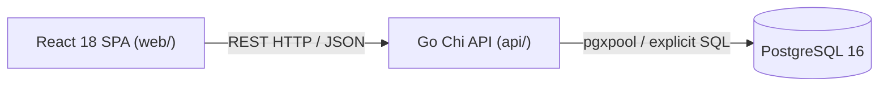

<h1 align="center">Personal Data OS</h1>

<p align="center">
  <strong>Your life. Your data.</strong>
</p>

<p align="center">
  A self-hosted, modular telemetry and quantified-self operating system built for total data ownership, privacy-first tracking, and cross-domain personal analytics.
</p>

<p align="center">
  <a href="https://github.com/rodrigolinhas/personal-data-os/actions/workflows/ci.yml">
    
  </a>
  <a href="LICENSE">
    
  </a>
  <a href="https://go.dev/">
    
  </a>
  <a href="https://react.dev/">
    
  </a>
  <a href="https://www.postgresql.org/">
    
  </a>
</p>

---

## 📑 Table of Contents

- [What is Personal Data OS?](#-what-is-personal-data-os)
- [Why It Exists](#-why-it-exists)
- [Feature Status](#-feature-status)
- [Quick Start](#-quick-start)
- [Environment Variables](#-environment-variables)
- [Project Structure](#-project-structure)
- [Architecture](#-architecture)
- [Technology Stack](#-technology-stack)
- [API & Telemetry](#-api-telemetry)
- [Development Commands](#-development-commands)
- [Roadmap](#-roadmap)
- [Privacy & Data Ownership](#-privacy-data-ownership)
- [Contributing](#-contributing)
- [Security](#-security)
- [License](#-license)

---

## 🧭 What is Personal Data OS?

**Personal Data OS** is a self-hosted personal data aggregator and telemetry hub. It unifies physical health metrics, cognitive habits, strength training, reading logs, and developer productivity into a single local database and command center.

---

## 💡 Why It Exists

Modern quantified-self tracking is fragmented across proprietary silos, subscription-gated dashboards, and closed clouds. Personal Data OS provides:
- **Total Data Ownership**: All data lives in your PostgreSQL database on your machine or private server.
- **Unified Cross-Domain Analytics**: Correlate sleep duration with reading velocity, habit consistency with workout frequency, and developer output.
- **Zero SaaS Lock-in**: No paid API tiers, no telemetry trackers, and no unexpected terms-of-service changes.
- **High Performance & Longevity**: Built as a lean modular monolith using Go, raw SQL, and React for decades of maintainability.

---

## 📊 Feature Status

### Implemented (Foundation Phase)
- [x] **Modular Monolith Foundation**: Go Chi backend + React Vite frontend.
- [x] **PostgreSQL Connection Pool**: Managed with `pgx/v5` (`pgxpool`) and health verification.
- [x] **Configuration Validation**: Centralized environment variable loader.
- [x] **Infrastructure Telemetry**: `GET /health` process liveness endpoint.
- [x] **Living API Contract**: OpenAPI 3.1 specification at `docs/openapi/openapi.yaml`.
- [x] **Continuous Integration**: GitHub Actions automated pipeline (formatting, vet, race tests, `govulncheck`, frontend typecheck, lint, Vitest, build).
- [x] **Containerized Database**: Docker Compose PostgreSQL 16 service with persistent volume.

### Planned (Roadmap Modules)
- [ ] **Sleep Tracking** (`M2`): Bedtime, wake time, duration, quality scores, and 7d/30d moving averages.
- [ ] **Reading & Books Tracker** (`M3`): Book library catalog, reading session logger, reading speed metrics.
- [ ] **Habits & Discipline** (`M4`): Daily/weekly habit definitions, completion toggles, streak counters.
- [ ] **Workouts & Strength** (`M5`): Relational exercise logger (workouts ➔ exercises ➔ sets with reps, weight, RPE).
- [ ] **GitHub Activity Telemetry** (`M6`): Automated commit sync, PRs, issues, active coding days.
- [ ] **Unified Command Center Dashboard** (`M7`): Cross-domain summary endpoint (`/api/v1/dashboard/summary`), period selector (Today / Week / Month / Year), and delta trends.

---

## ⚡ Quick Start

### 1. Clone Repository & Setup Environment
```bash
git clone https://github.com/rodrigolinhas/personal-data-os.git
cd personal-data-os
cp .env.example .env
```

### 2. Start PostgreSQL Database
```bash
docker compose up -d
```

### 3. Run Backend API (`api/`)
```bash
cd api
go run ./cmd/api
```
*API listens on `http://localhost:8080`.*

Test the health check endpoint:
```bash
curl http://localhost:8080/health
# Response: {"status":"ok","service":"personal-data-os-api","version":"0.1.0"}
```

### 4. Run Frontend Web App (`web/`)
In a separate terminal:
```bash
cd web
npm install
npm run dev
```
*Web dashboard opens at `http://localhost:5173` with automatic API proxying.*

---

## 🔐 Environment Variables

Configuration is loaded from `.env` using `.env.example` as the source of truth:

| Variable | Required | Description | Example |
| :--- | :--- | :--- | :--- |
| `APP_ENV` | No | Runtime environment (`development`, `production`) | `development` |
| `API_PORT` | Yes | HTTP server listen port | `8080` |
| `POSTGRES_HOST` | Yes | PostgreSQL server hostname | `localhost` |
| `POSTGRES_PORT` | Yes | PostgreSQL port | `5432` |
| `POSTGRES_DB` | Yes | Database name | `personal_data_os` |
| `POSTGRES_USER` | Yes | Database user | `personal_data` |
| `POSTGRES_PASSWORD`| Yes | Database password | `change_me` |
| `POSTGRES_SSLMODE` | Yes | SSL mode for database connection | `disable` |

---

## 📁 Project Structure

```text
personal-data-os/
├── .github/
│   ├── workflows/ci.yml         # Automated CI testing and validation pipeline
│   ├── ISSUE_TEMPLATE/          # Structured GitHub issue templates
│   └── PULL_REQUEST_TEMPLATE.md # Standardized PR review template
│
├── api/                         # Go HTTP Backend Service
│   ├── cmd/api/main.go          # Process entrypoint & graceful shutdown
│   ├── internal/
│   │   ├── config/              # Environment loading and validation
│   │   ├── database/            # PostgreSQL pgxpool connection management
│   │   └── http/                # Chi router, middlewares, and REST handlers
│   ├── db/
│   │   ├── migrations/          # Version-controlled golang-migrate SQL files
│   │   ├── queries/             # Explicit SQL query definitions
│   │   └── sqlc/                # Type-safe Go code generated by sqlc
│   ├── go.mod, go.sum, sqlc.yaml
│
├── web/                         # React SPA Web Application
│   ├── src/
│   │   ├── api/                 # API client wrapper and TanStack Query hooks
│   │   ├── app/                 # Application shell & status telemetry
│   │   ├── components/          # Shared reusable UI components
│   │   ├── features/            # Modular feature slices (sleep, reading, etc.)
│   │   ├── pages/               # Top-level view routes
│   │   └── shared/              # Test utilities and shared helpers
│   ├── package.json, vite.config.ts, tailwind.config.js, tsconfig.json
│
├── docs/                        # In-Depth Engineering Documentation
│   ├── architecture.md          # System architecture and layer responsibilities
│   ├── development.md           # Local setup and workflow guide
│   ├── database.md              # Database standards, migrations, and sqlc
│   ├── api.md                   # REST conventions and error handling
│   ├── roadmap.md               # Milestones M1 through M7
│   ├── open-questions.md        # Unresolved architectural decisions
│   └── openapi/openapi.yaml     # Living OpenAPI 3.1 contract
│
├── AGENTS.md                    # Guidelines for AI coding assistants
├── CONTRIBUTING.md               # Contributor guidelines and Definition of Done
├── SECURITY.md                   # Vulnerability reporting and data safety rules
├── docker-compose.yml           # Local PostgreSQL container definition
├── .env.example                 # Configuration template
├── .gitignore                   # Version control exclusions
└── LICENSE                      # MIT License
```

---

## 🏛️ Architecture

Personal Data OS uses a **Modular Monolith** architecture:



Detailed architectural diagrams and layer flows are documented in [docs/architecture.md](docs/architecture.md).

---

## 🛠️ Technology Stack

| Layer | Technology | Purpose |
| :--- | :--- | :--- |
| **Backend Language** | Go 1.27+ | Single-binary runtime, concurrency, low memory footprint |
| **HTTP Routing** | `go-chi/chi/v5` | Idiomatic HTTP routing and composable middleware |
| **Database Pool** | `jackc/pgx/v5` (`pgxpool`) | High-performance PostgreSQL connection pooling |
| **SQL Tooling** | `sqlc` | Type-safe Go query code generation from explicit SQL |
| **Migrations** | `golang-migrate` | Deterministic `.up.sql` / `.down.sql` schema versions |
| **Structured Logs**| `log/slog` | Standard library structured JSON/text logging |
| **Frontend UI** | React 18 + TypeScript | Strict-typed component interface |
| **Build Tooling** | Vite 5 | Fast development server and optimized bundle build |
| **Styling** | Tailwind CSS 3 | Utility-first styling with build-time CSS compilation |
| **Server State** | TanStack Query v5 | Declarative server-state caching and synchronization |
| **Forms & Schemas**| React Hook Form + Zod | Type-safe form validation matching backend contracts |
| **Testing** | Vitest + RTL & Go `testing` | Component, unit, and API integration testing |
| **Containerization**| Docker Compose | Local PostgreSQL 16 database service |
| **API Contract** | OpenAPI 3.1 | Machine-readable API specification |

---

## 📡 API & Telemetry

- **Base URL**: `http://localhost:8080`
- **Domain Namespace**: `/api/v1/*`
- **Infrastructure Health**: `GET /health` (returns `{"status":"ok","service":"personal-data-os-api","version":"0.1.0"}`)
- **OpenAPI Specification**: Located at [docs/openapi/openapi.yaml](docs/openapi/openapi.yaml).
- For design conventions and error formatting, see [docs/api.md](docs/api.md).

---

## 🧪 Development Commands

### Backend (`api/`)
```bash
cd api

# Run unit and integration tests with race detector
go test -v -race ./...

# Run static analysis
go vet ./...

# Verify code formatting
gofmt -l .

# Compile binary
go build -o bin/api ./cmd/api
```

### Frontend (`web/`)
```bash
cd web

# Run TypeScript typecheck
npm run typecheck

# Run ESLint
npm run lint

# Run Vitest test suite
npm test

# Build production bundle
npm run build
```

For full database migration and query generation commands, see [docs/development.md](docs/development.md).

---

## 🗺️ Roadmap

The roadmap is structured into sequential vertical slices:
- **Milestone 1**: Engineering Foundation Setup *(Completed)*
- **Milestone 2**: Sleep Tracking Module *(Next Vertical Slice)*
- **Milestone 3**: Reading & Books Tracker
- **Milestone 4**: Habits & Discipline Tracker
- **Milestone 5**: Workouts & Strength Module
- **Milestone 6**: GitHub Telemetry Collector
- **Milestone 7**: Unified Analytics Command Center

For detailed milestone deliverables and criteria, see [docs/roadmap.md](docs/roadmap.md).

---

## 🔒 Privacy & Data Ownership

Personal Data OS is built around strict data privacy rules:
- **User-Owned Storage**: Data remains strictly on your own hardware or private VPS.
- **Zero Third-Party Telemetry**: The application does not contain tracking scripts or analytics beacons.
- **Synthetic Fixtures**: All repository test fixtures, mocks, and documentation examples use synthetic sample data.
- **Credential Safety**: API tokens and database passwords must never be committed to Git.

---

## 🤝 Contributing

Contributions are welcome! Please review [CONTRIBUTING.md](CONTRIBUTING.md) for our branch naming conventions, Conventional Commits standard, and definition-of-done checklist.

---

## 🛡️ Security

To report a vulnerability or read our data protection policies, please consult [SECURITY.md](SECURITY.md).

---

## 📄 License

This project is licensed under the [MIT License](LICENSE).
