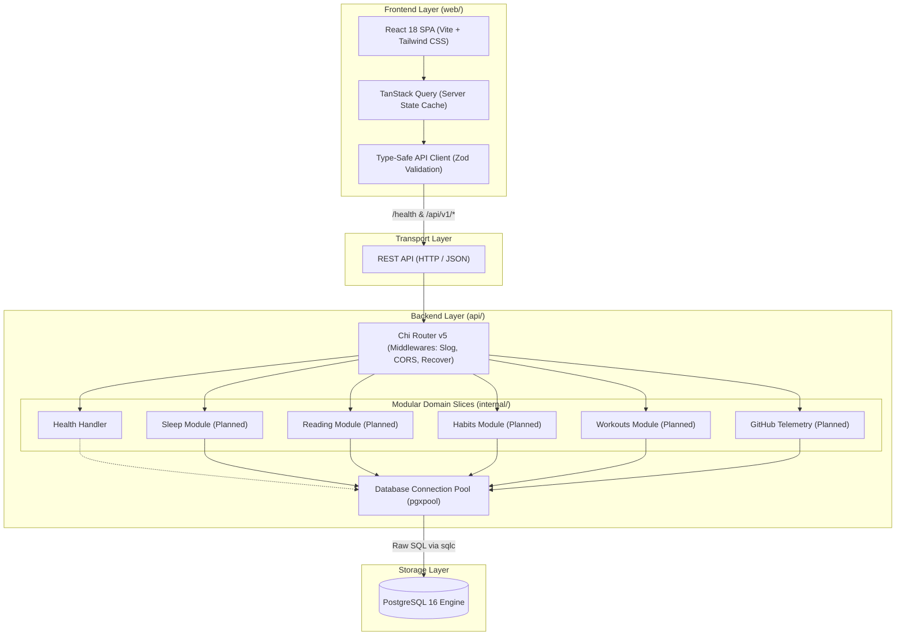

# Architecture Guide — Personal Data OS

This document outlines the architectural principles, system design, and engineering patterns governing **Personal Data OS**.

---

## 1. System Philosophy

Personal Data OS is designed as a **Modular Monolith**. It avoids the operational overhead, network latency, and distributed failure modes of microservices, message brokers (Kafka/RabbitMQ), and distributed caches (Redis).



---

## 2. Layer Responsibilities

### Frontend (`web/`)
- **Technology**: React 18, TypeScript (strict mode), Vite, Tailwind CSS, TanStack Query v5, React Hook Form, Zod.
- **Responsibilities**:
  - Declarative UI rendering with responsive design.
  - Server-state caching, deduping, and optimistic updates via TanStack Query.
  - Client-side input validation via Zod schemas matching OpenAPI contracts.
  - Zero business logic duplication; backend remains the single source of truth for calculations and validation.

### Backend (`api/`)
- **Technology**: Go 1.27+, `go-chi/chi/v5`, `jackc/pgx/v5` (`pgxpool`), `sqlc`.
- **Responsibilities**:
  - HTTP routing, request deserialization, and strict input validation.
  - Domain business logic, aggregations, and metrics computation.
  - Atomic database transactions.
  - Structured logging via standard library `log/slog`.
  - Graceful process lifecycle management (`SIGINT`/`SIGTERM`).

### Storage (`api/db/`)
- **Technology**: PostgreSQL 16.
- **Responsibilities**:
  - Relational integrity with foreign keys, check constraints, and unique constraints.
  - Version-controlled schema migrations (`golang-migrate` format).
  - Explicit, reviewable SQL queries compiled into type-safe Go code with `sqlc`.

---

## 3. Vertical Slice Methodology

New features are implemented as cohesive, end-to-end **Vertical Slices** rather than horizontal architecture layers. Every module slice spans from the database schema up to the user interface:

```text
1. Database Schema
   └── Versioned migration in api/db/migrations/ (e.g. 000001_create_sleep_logs.up.sql)
2. Explicit SQL Queries
   └── SQL definitions in api/db/queries/ (e.g. sleep.sql)
3. sqlc Code Generation
   └── Type-safe Go structs and query runners in api/db/sqlc/
4. Domain Service & Repository
   └── Business logic & validation in api/internal/<domain>/
5. HTTP Handlers & Router
   └── REST endpoints mounted under /api/v1/<domain> in api/internal/http/
6. Automated Tests
   └── Unit & integration tests in api/internal/<domain>/ and api/internal/http/
7. OpenAPI Documentation
   └── Endpoint contracts documented in docs/openapi/openapi.yaml
8. Frontend API Client & Types
   └── Zod schemas and query hooks in web/src/features/<domain>/api/
9. Frontend UI Components
   └── Forms, cards, tables in web/src/features/<domain>/
10. Frontend Tests
   └── Vitest unit tests in web/src/features/<domain>/
```

---

## 4. Domain Boundaries

Domain packages inside `api/internal/` and `web/src/features/` remain self-contained:
- **Sleep**: Daily sleep tracking, bedtime, wake time, duration calculations, quality ratings, rolling 7d/30d averages.
- **Reading**: Book catalog management, reading session logging, reading speed (pages/hour) computations.
- **Workouts**: Workout sessions, exercise catalog, set logging (reps, weight, RPE), volume calculations.
- **Habits**: Habit definitions, frequencies (daily/weekly), completion checkoffs, streak counters.
- **GitHub**: Telemetry sync, daily commit counts, PRs, issues, active coding day metrics.
- **Analytics Layer**: High-level cross-domain aggregations (`/api/v1/dashboard/summary`), period comparative deltas (today, week, month, year).

---

## 5. External Integration Philosophy

- Integrations (e.g. GitHub API) run as asynchronous collectors or manual sync endpoints within the monolith.
- External API credentials and tokens are stored exclusively in environment variables and never logged or committed.
- External service failures (e.g. GitHub rate limits or outages) degrade gracefully without taking down the core application or blocking manual data entry.
